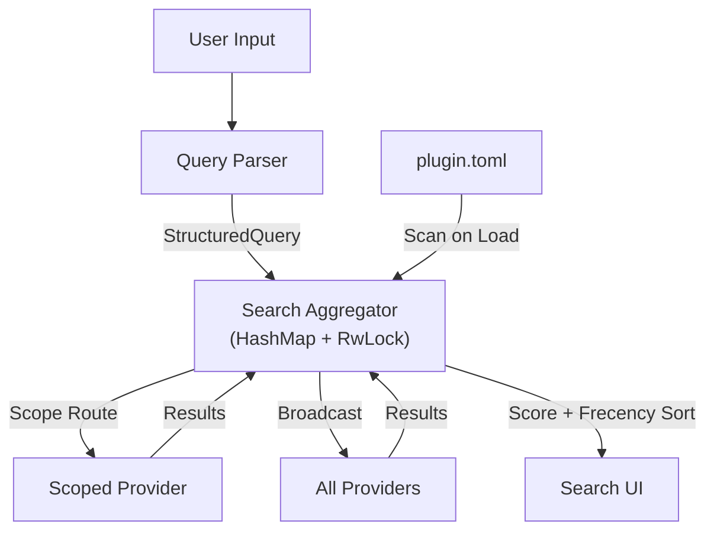

# Design: Extensible Aggregated Search

## Architecture Overview

The system extends the existing `SearchAggregator` with:
1. A `QueryParser` for structured queries
2. HashMap-based dynamic provider storage
3. Manifest-based plugin registration



## Core Components

### 1. Query Parser (`QueryParser`)

**File**: `src-tauri/src/search/query_parser.rs`

- **Responsibility**: Parse raw input strings into `StructuredQuery`.
- **Syntax**: `[scope:] [terms] [key:value]`
    - Example: `gh: rust language` (scope: github)
    - Example: `type:pdf machine learning` (filter: type=pdf)
    - Example: `"hello world" python` (phrase + term)
- **Output**:
    ```rust
    pub struct StructuredQuery {
        pub raw: String,                    // Original input
        pub terms: Vec<String>,             // ["rust", "language"]
        pub phrases: Vec<String>,           // ["hello world"]
        pub filters: HashMap<String, String>, // {"type": "pdf"}
        pub scope: Option<String>,          // Some("gh")
    }
    ```

### 2. Search Aggregator (Refactored)

**File**: `src-tauri/src/search/aggregator.rs`

**Key Change**: `Vec` → `std::sync::RwLock<HashMap<String, Box<dyn SearchProvider>>>`

**Lock Strategy**: Use `std::sync::RwLock` (not `tokio::sync::RwLock`) with a **clone-and-release** pattern. The lock is held only long enough to clone the list of providers (or look up a single provider by scope), then released before any `.await` points. This avoids holding a sync lock across async boundaries.

```rust
pub struct SearchAggregator {
    providers: std::sync::RwLock<HashMap<String, Box<dyn SearchProvider>>>,
}

impl SearchAggregator {
    /// Register a provider with a unique ID. Takes &self (not &mut self).
    pub fn register(&self, id: String, provider: Box<dyn SearchProvider>);

    /// Unregister a provider by ID.
    pub fn unregister(&self, id: &str);

    /// Execute search with scope routing.
    /// Lock is acquired briefly to clone/collect provider refs, then released.
    pub async fn search(&self, ctx: &SearchContext) -> Result<Vec<ProviderResult>, SearchError>;
}
```

**Scope Routing**:
- If `query.scope == Some("gh")`, only dispatch to provider with ID `"gh"` or `"plugin:gh"`
- If `query.scope == None`, broadcast to all providers

### 3. Plugin Registration (Manifest-Based)

**Critical**: Plugins are **subprocesses**, they cannot directly register Rust trait objects.

**Architectural Shift**: The current codebase has a **single monolithic `PluginSearchProvider`** (with `source_id() == "plugins"`) that internally routes queries via `detect_keyword()`. This design changes that to **one `PluginSearchProvider` proxy instance per plugin command**, each registered individually with the aggregator.

**Why**: Per-plugin registration enables scope routing at the aggregator level (O(1) HashMap lookup by ID) and eliminates the need for internal keyword detection logic in `PluginSearchProvider`.

**Current Flow** (being replaced):
1. One `PluginSearchProvider` registered with `source_id = "plugins"`
2. On search, `detect_keyword()` checks first word against all plugin keywords
3. If matched, routes to that specific plugin

**New Flow**:
1. Plugin declares `mode = "search"` in a command within `plugin.toml`
2. `PluginRegistry::load()` scans manifests
3. Host creates a **per-command** `PluginSearchProvider` proxy, constructed with:
   - Reference to the specific `PluginCommand`
   - Reference to `PluginExecutor` and `DataService`
   - `source_id()` returns `"plugin:<plugin_name>:<command_name>"`
4. Host calls `aggregator.register("plugin:<keyword>", proxy)`
5. The old monolithic `PluginSearchProvider.detect_keyword()` logic is **removed**

```rust
/// Per-command plugin search proxy
pub struct PluginSearchProvider {
    plugin_name: String,
    command: PluginCommand,
    executor: Arc<PluginExecutor>,
    data_service: Arc<DataService>,
}

impl PluginSearchProvider {
    pub fn new(
        plugin_name: String,
        command: PluginCommand,
        executor: Arc<PluginExecutor>,
        data_service: Arc<DataService>,
    ) -> Self { /* ... */ }
}
```

```toml
# plugin.toml example
[plugin]
name = "github-search"
title = "GitHub Search"

[[commands]]
name = "search-repos"
keyword = "gh"
mode = "search"
script = "dist/index.js"
runtime = "node"
```

### 4. Provider Contract (Unchanged Signature)

The `SearchProvider` trait signature remains **unchanged**. Instead, `SearchContext` is extended with the parsed query:

```rust
pub struct SearchContext {
    pub query: String,                          // Original raw input (backward compat)
    pub structured_query: StructuredQuery,      // Parsed structured form
    pub limit: usize,
    pub fuzzy: bool,
    pub sources: Option<Vec<String>>,
}

#[async_trait]
pub trait SearchProvider: Send + Sync {
    fn source_id(&self) -> &str;
    fn source_label(&self) -> &str;
    fn source_type(&self) -> SourceType;

    /// Signature unchanged. Providers access structured_query via ctx.
    async fn search(&self, ctx: &SearchContext) -> Result<Vec<ProviderResult>, SearchError>;
}
```

**Why extend rather than replace?** This preserves backward compatibility — existing providers continue working with `ctx.query`, while updated providers can leverage `ctx.structured_query` for filters and scope. All existing fields (`limit`, `fuzzy`, `sources`) remain available.

## Data Flow

### Keyword Syntax Migration

The current system uses `"gh react"` (space-separated keyword) for plugin routing. This design introduces `"gh: react"` (colon scope syntax). Both must coexist during transition:

| Input | Parser Interpretation | Behavior |
|-------|----------------------|----------|
| `gh: react` | `scope = "gh"`, `terms = ["react"]` | Scope route to `"plugin:gh"` only |
| `gh react` | `scope = None`, `terms = ["gh", "react"]` | Broadcast to all providers (backward compat) |
| `type:pdf rust` | `scope = None`, `filters = {"type": "pdf"}`, `terms = ["rust"]` | Broadcast with filter |

**Key rule**: A scope MUST have a colon immediately after the keyword (e.g., `gh:`). A bare word without colon is treated as a regular search term. This preserves backward compatibility — existing `"gh react"` queries continue to broadcast to all providers, and the old monolithic `PluginSearchProvider` keyword-matching path is replaced by the per-plugin proxy registration.

**Migration path**: Users can optionally adopt the `gh:` scope syntax for direct routing. Broadcast queries still reach plugin providers since they are individually registered with the aggregator.

### Example: Scoped Search `gh: react hooks`

1. `QueryParser` extracts `scope=Some("gh")`, `terms=["react", "hooks"]`
2. `Aggregator.search()` finds provider with ID matching `"gh"` or `"plugin:gh"`
3. Only `PluginSearchProvider("github-search")` is invoked
4. Plugin receives JSON: `{"terms": ["react", "hooks"], "scope": "gh"}`
5. Results return, ranked by Score*0.7 + Frecency*0.3

### Example: Filtered Search `rust type:pdf`

1. `QueryParser` extracts `terms=["rust"]`, `filters={"type": "pdf"}`
2. `Aggregator.search()` broadcasts to all providers
3. `FileSearchProvider` recognizes `type` filter, queries Tantivy for `body:rust AND extension:pdf`
4. `BookmarkSearchProvider` ignores unknown filter, queries normally
5. Results merged, normalized, sorted

## Ranking (Simple, No Engine)

Keep the existing formula in `Aggregator`:

```rust
const SCORE_WEIGHT: f64 = 0.7;
const FRECENCY_WEIGHT: f64 = 0.3;

// Per-provider min-max normalization, then:
global_score = norm_score * SCORE_WEIGHT + norm_frecency * FRECENCY_WEIGHT;
```

**No ContextAware, No AI Re-ranking.** These are over-engineered for a local launcher.

## Registration Wiring

The key question: **how does `PluginRegistry` call `aggregator.register()`?**

### Startup Wiring (in `lib.rs`)

```rust
// 1. Create aggregator (empty)
let aggregator = Arc::new(SearchAggregator::new());

// 2. Register built-in providers
aggregator.register("bookmarks".into(), Box::new(bookmark_provider));
aggregator.register("files".into(), Box::new(file_provider));

// 3. Create plugin registry with aggregator reference
let plugin_registry = Arc::new(PluginRegistry::new(
    plugins_dir,
    Arc::clone(&aggregator),  // <-- NEW: inject aggregator
));

// 4. Discover plugins (auto-registers search providers)
plugin_registry.discover().await?;

// 5. Store in AppState as usual
let app_state = AppState {
    search_aggregator: aggregator,
    plugin_registry,
    // ...
};
```

### Dynamic Registration Events

| Event | Action |
|-------|--------|
| `PluginRegistry::discover()` | For each command with `mode="search"`, create proxy and call `aggregator.register()` |
| `PluginRegistry::install_from_dir()` | After install, scan new manifest for search commands, register proxies |
| `PluginRegistry::uninstall()` | Call `aggregator.unregister("plugin:<keyword>")` for each search command |
| Plugin enable/disable toggle | Register or unregister accordingly |

### Scope Miss Behavior

If `query.scope = Some("gh")` but no provider matches `"gh"` or `"plugin:gh"`:
- Return **empty results** with a `SearchError::ProviderNotFound("gh")` variant
- The UI should display: "No search provider found for scope 'gh'"

## Trade-offs

- **Parsing Overhead**: ~1-5ms, acceptable for flexibility gained.
- **Plugin Latency**: Subprocess communication adds ~10-50ms. Acceptable for non-critical sources.
- **Filter Support**: Not all providers support all filters. Ignored gracefully.

## What We're NOT Doing

| Rejected Idea | Why |
|--------------|-----|
| Runtime plugin FFI registration | Plugins are subprocesses, can't register Rust objects |
| ContextAware Ranking | Requires OS permissions, unclear benefit |
| AI Re-ranking | Adds 50-200ms latency |
| Separate RankingEngine | Over-abstraction for single formula |
