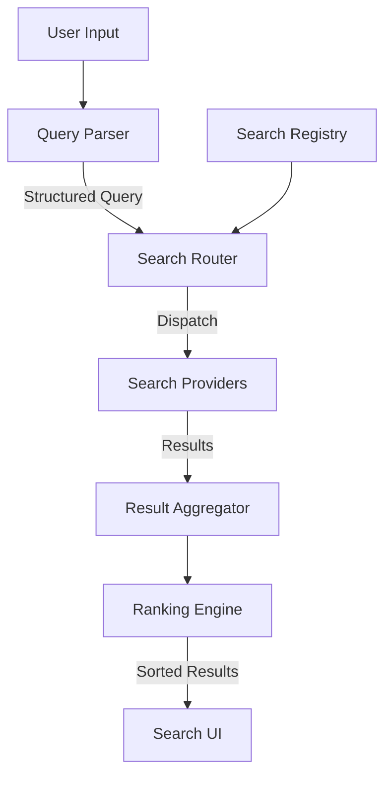

# Design: Extensible Aggregated Search

## Architecture Overview

The system centers around a `SearchRegistry` that manages a dynamic collection of `SearchProvider`s. A `QueryParser` interprets user input into structured queries, and a `RankingEngine` sorts results based on context and relevance.



## Core Components

### 1. Search Registry (`SearchRouter`)

- **Responsibility**: Manages the lifecycle of search providers.
- **Capabilities**:
    - `register_provider(id, provider)`: Add a new source dynamically.
    - `unregister_provider(id)`: Remove a source.
    - `list_providers()`: Return available sources.
- **Extensibility**: Plugins can register providers via IPC or direct FFI.

### 2. Query Parser (`QueryParser`)

- **Responsibility**: Parse raw input strings into structured `SearchContext`.
- **Syntax**: `[scope:] [query] [filters]`
    - Example: `gh: rust language` (scope: github)
    - Example: `type:pdf machine learning` (filter: type=pdf)
- **Output**:
    ```rust
    struct StructuredQuery {
        raw: String,
        terms: Vec<String>,
        filters: HashMap<String, String>,
        scope: Option<String>,
    }
    ```

### 3. Ranking Engine (`RankingEngine`)

- **Responsibility**: Score and sort results from disparate sources.
- **Strategies**:
    - `StaticScore`: Base relevance from provider.
    - `Frecency`: Frequency + Recency (local usage).
    - `ContextAware`: Boost results relevant to active app or time.
    - `AIRelevance`: Optional ML-based re-ranking.

### 4. Provider Contract (`SearchProvider`)

- **Interface**:
    ```rust
    trait SearchProvider {
        fn search(&self, query: &StructuredQuery) -> Future<Result<Vec<ResultItem>>>;
        fn capabilities(&self) -> ProviderCapabilities; // e.g., supports_filters, slow_source
    }
    ```

## Data Flow

1.  User types "rust type:pdf".
2.  `QueryParser` extracts `terms=["rust"]`, `filters={type: "pdf"}`.
3.  `SearchRouter` identifies providers capable of handling `type:pdf` (e.g., FileProvider).
4.  Router dispatches to relevant providers in parallel.
5.  `FileSearchProvider` translates to Tantivy query: `body:rust AND extension:pdf`.
6.  Results stream back to `Aggregator`.
7.  `RankingEngine` boosts frequently opened PDFs.
8.  UI renders results.

## Trade-offs

-   **Complexity vs. Speed**: Parsing and advanced ranking add latency. Must optimization for <50ms parsing.
-   **Consistency**: Different providers may return different metadata fields. Need a standardized Schema (already started with `UnifiedSearchResult`).
